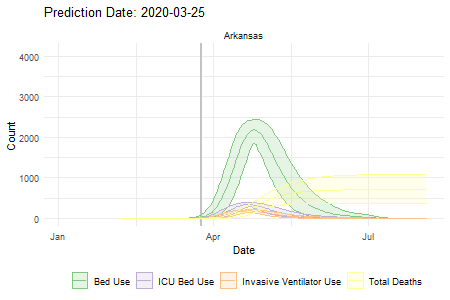

```{r setup, include=FALSE}
knitr::opts_chunk$set(message=TRUE, warning=TRUE, tinytex.verbose=TRUE,dpi=600)
```

# IHME Model Over Time

The [Institute for Health Metrics and Evaluation (IHME)](http://covid19.healthdata.org/united-states-of-america) at the University of Washington has released a series of models for COVID19 cases, mortality and hospital resource utilization. These models have evolved over time. Here we plot how these models have changed.

## All 50 States


## Alabama


## Alaska


## Arizona


## Arkansas


## California


## Colorado


## Connecticut


## Delaware


## District of Columbia


## Florida


## Georgia


## Hawaii


## Idaho


## Illinois


## Indiana


## Iowa


## Kansas


## Kentucky


## Louisiana


## Maine


## Maryland


## Massachusetts


## Michigan


## Minnesota


## Mississippi


## Missouri


## Montana


## Nebraska


## Nevada


## New Hampshire


## New Jersey


## New Mexico


## New York


## North Carolina


## North Dakota


## Ohio


## Oklahoma


## Oregon


## Pennsylvania


## Rhode Island


## South Carolina


## South Dakota


## Tennessee


## Texas


## Utah


## Vermont


## Virginia


## Washington


## West Virginia


## Wisconsin


## Alabama


## Wyoming

